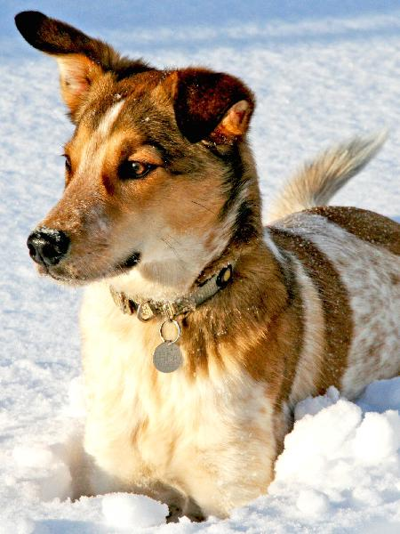
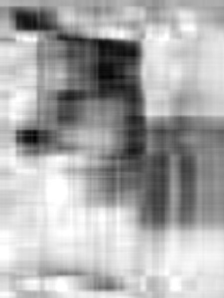
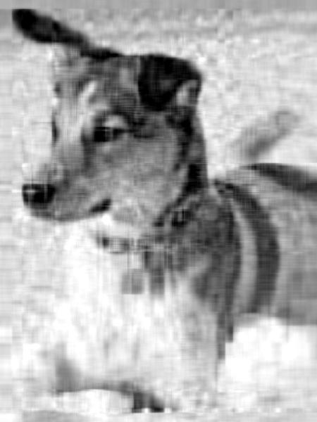
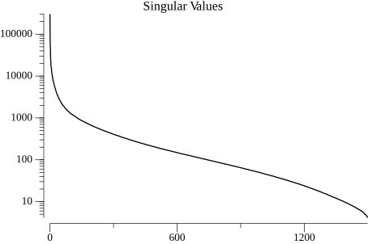
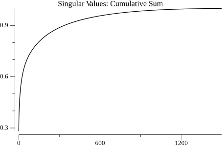

<!-- Code generated by `gd -o CH01_SEC02.md CH01_SEC02.go`; DO NOT EDIT. -->
```
//go:generate bash -c "rm -f CH01_SEC02*.jpeg CH01_SEC02*.png"
//go:generate gd -o CH01_SEC02.md CH01_SEC02.go

package main

import (
	"fmt"
	"image"
	"image/color"
	_ "image/jpeg"
	"log"
	"math"
	"os"
	"path/filepath"

	drawimg "golang.org/x/image/draw"

	"github.com/kortschak/gd/show"

	"gonum.org/v1/gonum/floats"
	"gonum.org/v1/gonum/mat"
	"gonum.org/v1/plot"
	"gonum.org/v1/plot/plotter"
	"gonum.org/v1/plot/vg"
	"gonum.org/v1/plot/vg/draw"
	"gonum.org/v1/plot/vg/vgimg"
)

func main() {
	f, err := os.Open(filepath.FromSlash("../DATA/dog.jpg"))
	if err != nil {
		log.Fatal(err)
	}
	defer f.Close()
	img, _, err := image.Decode(f)
	if err != nil {
		log.Fatal(err)
	}

	show.JPEG(scaled(img, 600), nil, "", "Original image")
```
> 
```

	rect := img.Bounds()
	rows, cols := rect.Dy(), rect.Dx()
	a := mat.NewDense(rows, cols, nil)
	for i := 0; i < rows; i++ {
		for j := 0; j < cols; j++ {
			a.Set(i, j, float64(color.GrayModel.Convert(img.At(rect.Min.Y+j, rect.Min.X+i)).(color.Gray).Y))
		}
	}

	fmt.Println(mat.Formatted(a, mat.Excerpt(4)))
```
> ```stdout
> Dims(2000, 1500)
> ⎡169  168  165  163  ...  ...  168  168  167  164⎤
> ⎢165  165  166  166            168  168  167  164⎥
> ⎢167  169  171  171            166  167  166  164⎥
> ⎢163  164  165  164            165  165  165  164⎥
>  .
>  .
>  .
> ⎢247  247  246  246            212  211  212  214⎥
> ⎢247  247  247  246            215  214  215  216⎥
> ⎢248  247  247  246            214  213  214  215⎥
> ⎣248  247  247  246  ...  ...  214  214  214  215⎦
> ```
```

	var svd mat.SVD
	ok := svd.Factorize(a, mat.SVDThin)
	if !ok {
		log.Fatal("failed to factorize matrix")
	}
	var u, v mat.Dense
	svd.UTo(&u)
	svd.VTo(&v)
	sigma := svd.Values(nil)

	var aApprox mat.Dense
	for _, r := range []int{5, 20, 100} {
		s := mat.NewDiagDense(r, sigma[:r])
		aApprox.Product(u.Slice(0, rows, 0, r), s, v.Slice(0, cols, 0, r).T())

		img := image.NewGray(rect)
		for i := 0; i < rows; i++ {
			for j := 0; j < cols; j++ {
				v := math.Min(math.Max(0, aApprox.At(i, j)), 255)
				img.Set(j, i, color.Gray{Y: uint8(v)})
			}
		}

		show.JPEG(scaled(img, 600), nil, "", fmt.Sprintf("r = %d", r))
```
> 

> 

> 
```
	}

	p1 := plot.New()
	p1.Title.Text = "Singular Values"
	p1.Y.Scale = plot.LogScale{}
	p1.Y.Tick.Marker = plot.LogTicks{}
	values, err := plotter.NewLine(sliceToXYs(sigma))
	if err != nil {
		log.Fatal(err)
	}
	p1.Add(values)
	c1 := vgimg.New(12*vg.Centimeter, 8*vg.Centimeter)
	p1.Draw(draw.New(c1))
	show.PNG(c1.Image(), "", "")
```
> 
```

	p2 := plot.New()
	p2.Title.Text = "Singular Values: Cumulative Sum"
	cumsum := floats.CumSum(make([]float64, len(sigma)), sigma)
	floats.Scale(1/floats.Max(cumsum), cumsum)
	values, err = plotter.NewLine(sliceToXYs(cumsum))
	if err != nil {
		log.Fatal(err)
	}
	p2.Add(values)
	c2 := vgimg.New(12*vg.Centimeter, 8*vg.Centimeter)
	p2.Draw(draw.New(c2))
	show.PNG(c2.Image(), "", "")
```
> 
```
}

```
The code below is helper code only.
```

func sliceToXYs(s []float64) plotter.XYs {
	xy := make(plotter.XYs, len(s))
	for i, v := range s {
		xy[i] = plotter.XY{X: float64(i), Y: v}
	}
	return xy
}

func scaled(img image.Image, max int) image.Image {
	rect := img.Bounds()
	dx, dy := rect.Dx(), rect.Dy()
	switch {
	case dx < dy:
		dx, dy = dx*max/dy, max
	case dy < dx:
		dx, dy = max, dy*max/dx
	default:
		dx, dy = max, max
	}
	scaled := image.NewRGBA(image.Rect(0, 0, dx, dy))
	drawimg.NearestNeighbor.Scale(scaled, scaled.Bounds(), img, rect, drawimg.Over, nil)
	return scaled
}
```
