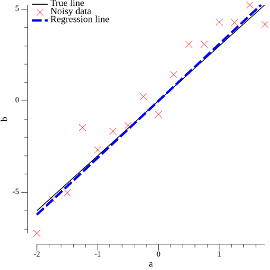

<!-- Code generated by `gd -o CH01_SEC04_1_Linear.md CH01_SEC04_1_Linear.go`; DO NOT EDIT. -->
```
//go:generate bash -c "rm -f CH01_SEC04_1_Linear*.png"
//go:generate gd -o CH01_SEC04_1_Linear.md CH01_SEC04_1_Linear.go

package main

import (
	"fmt"
	"image/color"
	"log"
	"math/rand"

	"github.com/kortschak/gd/show"

	"gonum.org/v1/gonum/mat"
	"gonum.org/v1/gonum/stat"
	"gonum.org/v1/plot"
	"gonum.org/v1/plot/plotter"
	"gonum.org/v1/plot/vg"
	"gonum.org/v1/plot/vg/draw"
	"gonum.org/v1/plot/vg/vgimg"
)

func main() {
	x := 3.0
	a := mat.NewVecDense(16, nil)
	for i := 0; i < a.Len(); i++ {
		a.SetVec(i, -2+float64(i)*0.25)
	}

	var b mat.VecDense
	b.ScaleVec(x, a)

	for i := 0; i < a.Len(); i++ {
		b.SetVec(i, b.AtVec(i)+rand.NormFloat64())
	}

	var svd mat.SVD
	ok := svd.Factorize(a, mat.SVDThin)
	if !ok {
		log.Fatal("failed to factorize matrix")
	}
	var u, v mat.Dense
	svd.UTo(&u)
	svd.VTo(&v)
	sigma := svd.Values(nil)
	s := mat.NewDiagDense(len(sigma), sigma)

	var sInv mat.Dense
	err := sInv.Inverse(s)
	if err != nil {
		log.Fatalf("S is not invertible: %v", err)
	}

	var xTilde mat.Dense
	xTilde.Product(&v, &sInv, u.T(), &b)
	fmt.Println(xTilde.At(0, 0))
```
> ```stdout
> 3.106627720716998
> ```
```

	p1 := plot.New()
	p1.X.Label.Text = "a"
	p1.Y.Label.Text = "b"

	values, err := plotter.NewScatter(slicesToXYs(a.RawVector().Data, b.RawVector().Data))
	if err != nil {
		log.Fatal(err)
	}
	values.GlyphStyle.Color = color.RGBA{R: 255, A: 255}
	values.GlyphStyle.Radius = 6
	values.GlyphStyle.Shape = draw.CrossGlyph{}
	p1.Add(values)

	truth := plotter.NewFunction(func(a float64) float64 { return a * x })
	truth.XMin = a.AtVec(0)
	truth.XMax = a.AtVec(a.Len() - 1)
	p1.Add(truth)

	estimate := plotter.NewFunction(func(a float64) float64 { return a * xTilde.At(0, 0) })
	estimate.XMin = a.AtVec(0)
	estimate.XMax = a.AtVec(a.Len() - 1)
	estimate.LineStyle.Color = color.RGBA{B: 255, A: 255}
	estimate.LineStyle.Width = 3
	estimate.LineStyle.Dashes = []vg.Length{12, 4}
	p1.Add(estimate)

	p1.Legend.Top = true
	p1.Legend.Left = true
	p1.Legend.Add("True line", truth)
	p1.Legend.Add("Noisy data", values)
	p1.Legend.Add("Regression line", estimate)

	c1 := vgimg.New(12*vg.Centimeter, 12*vg.Centimeter)
	p1.Draw(draw.New(c1))
	show.PNG(c1.Image(), "", "")
```
> 
```

```
Alternatively, the `stat.LinearRegression` function can be used and is more efficient.
Note that here the input data is taken as `[]float64` rather than matrices.
```
	_, xTilde3 := stat.LinearRegression(a.RawVector().Data, b.RawVector().Data, nil, true)
	fmt.Println(xTilde3)
```
> ```stdout
> 3.1066277207169977
> ```
```

```
The second method shown for the Matlab and Python code is functionally identical to
the first method shown and is not directly provided by Gonum.
```
}

func slicesToXYs(x, y []float64) plotter.XYs {
	if len(x) != len(y) {
		log.Fatalf("mismatched data lengths %d != %d", len(x), len(y))
	}
	xy := make(plotter.XYs, len(x))
	for i := range x {
		xy[i] = plotter.XY{X: x[i], Y: y[i]}
	}
	return xy
}
```
