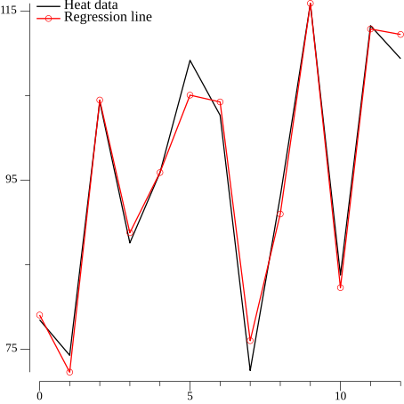

<!-- Code generated by `gd -o CH01_SEC04_2_Cement.md CH01_SEC04_2_Cement.go`; DO NOT EDIT. -->
```
//go:generate bash -c "rm -f CH01_SEC04_2_Cement*.png"
//go:generate gd -o CH01_SEC04_2_Cement.md CH01_SEC04_2_Cement.go

package main

import (
	"encoding/csv"
	"fmt"
	"image/color"
	"log"
	"os"
	"path/filepath"
	"strconv"

	"github.com/kortschak/gd/show"
	"gonum.org/v1/gonum/mat"
	"gonum.org/v1/plot"
	"gonum.org/v1/plot/plotter"
	"gonum.org/v1/plot/vg"
	"gonum.org/v1/plot/vg/draw"
	"gonum.org/v1/plot/vg/vgimg"
)

func main() {
	var a mat.Dense
	readCSV(&a, filepath.FromSlash("../DATA/hald_ingredients.csv"))

	var b mat.VecDense
	readCSV(&b, filepath.FromSlash("../DATA/hald_heat.csv"))

	var svd mat.SVD
	ok := svd.Factorize(&a, mat.SVDThin)
	if !ok {
		log.Fatal("failed to factorize matrix")
	}
	var u, v mat.Dense
	svd.UTo(&u)
	svd.VTo(&v)
	sigma := svd.Values(nil)
	s := mat.NewDiagDense(len(sigma), sigma)

	var sInv mat.Dense
	err := sInv.Inverse(s)
	if err != nil {
		log.Fatalf("S is not invertible: %v", err)
	}

	var x mat.Dense
	x.Product(&v, &sInv, u.T(), &b)

	fmt.Println(mat.Formatted(x.T()))
```
> ```stdout
> [ 2.1930460168128043   1.1533259694708693   0.7585091443218919  0.48631932562254043]
> ```
```

	var ax mat.Dense
	ax.Mul(&a, &x)

	p := plot.New()

	heat, err := plotter.NewLine(sliceToXYs(b.RawVector().Data))
	if err != nil {
		log.Fatal(err)
	}
	p.Add(heat)
	rLine, rPoint, err := plotter.NewLinePoints(sliceToXYs(ax.RawMatrix().Data))
	rLine.Color = color.RGBA{R: 255, A: 255}
	rPoint.Color = color.RGBA{R: 255, A: 255}
	if err != nil {
		log.Fatal(err)
	}
	p.Add(rLine, rPoint)

	p.Legend.Top = true
	p.Legend.Left = true
	p.Legend.Add("Heat data", heat)
	p.Legend.Add("Regression line", rLine, rPoint)

	c := vgimg.New(12*vg.Centimeter, 12*vg.Centimeter)
	p.Draw(draw.New(c))
	show.PNG(c.Image(), "", "")
```
> 
```

	// # Alternative Methods:
	//
	// The first Matlab alternative, x = regress(b,A), is equivalent to a
	// vector solve.
	var x1 mat.VecDense
	x1.SolveVec(&a, &b)
	fmt.Println(mat.Formatted(x1.T()))
```
> ```stdout
> [ 2.193046016812807  1.1533259694708704  0.7585091443218893  0.4863193256225417]
> ```
```
```
The second method shown for the Matlab and Python code is functionally identical to
the first method shown and is not directly provided by Gonum.
```
}

```
The code below is helper code only.
```

func readCSV(dst mat.Matrix, path string) {
	f, err := os.Open(path)
	if err != nil {
		log.Fatal(err)
	}
	defer f.Close()
	r := csv.NewReader(f)
	data, err := r.ReadAll()
	if err != nil {
		log.Fatal(err)
	}
	if len(data) == 0 {
		log.Fatalf("%s is empty", path)
	}
	switch dst := dst.(type) {
	case *mat.Dense:
		dst.ReuseAs(len(data), len(data[0]))
		for i, l := range data {
			for j, s := range l {
				v, err := strconv.ParseFloat(s, 64)
				if err != nil {
					log.Fatal(err)
				}
				dst.Set(i, j, v)
			}
		}
	case *mat.VecDense:
		dst.ReuseAsVec(len(data))
		for i, l := range data {
			v, err := strconv.ParseFloat(l[0], 64)
			if err != nil {
				log.Fatal(err)
			}
			dst.SetVec(i, v)
		}
	}
}

func sliceToXYs(s []float64) plotter.XYs {
	xy := make(plotter.XYs, len(s))
	for i, v := range s {
		xy[i] = plotter.XY{X: float64(i), Y: v}
	}
	return xy
}
```
