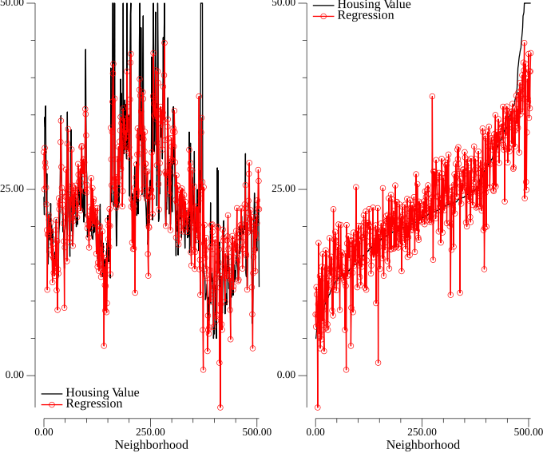
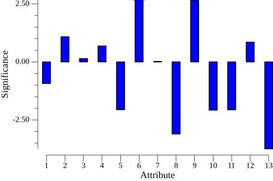

<!-- Code generated by `gd -o CH01_SEC04_3_Housing.md CH01_SEC04_3_Housing.go`; DO NOT EDIT. -->
```
//go:generate bash -c "rm -f CH01_SEC04_3_Housing*.png"
//go:generate gd -o CH01_SEC04_3_Housing.md CH01_SEC04_3_Housing.go

package main

import (
	"bufio"
	"fmt"
	"image/color"
	"log"
	"math"
	"os"
	"path/filepath"
	"sort"
	"strconv"
	"strings"

	"github.com/kortschak/gd/show"

	"gonum.org/v1/gonum/mat"
	"gonum.org/v1/gonum/stat"
	"gonum.org/v1/plot"
	"gonum.org/v1/plot/plotter"
	"gonum.org/v1/plot/vg"
	"gonum.org/v1/plot/vg/draw"
	"gonum.org/v1/plot/vg/vgimg"
)

func main() {
	var h mat.Dense
	readText(&h, filepath.FromSlash("../DATA/housing.data"))
	r, c := h.Dims()
	var a mat.Dense
	a.CloneFrom(&h)
	for i := 0; i < r; i++ {
		a.Set(i, c-1, 1) // Pad with ones for nonzero offset
	}
	b := h.ColView(c - 1)

	// The Python code uses SVD to solve for Ax=b and the book uses
	// Matlab's regress. Use SolveVec for simplicity.
	var x mat.VecDense
	x.SolveVec(&a, b)

	var ax mat.VecDense
	ax.MulVec(&a, &x)

	p1 := []*plot.Plot{plot.New(), plot.New()}
	value := line(vectorToSlice(b), color.RGBA{A: 255})
	rLine, rPoint := linePoints(vectorToSlice(&ax), color.RGBA{R: 255, A: 255})
	p1[0].Add(value, rLine, rPoint)
	p1[0].Legend.Top = false
	p1[0].Legend.Left = true
	p1[0].Legend.Add("Housing Value", value)
	p1[0].Legend.Add("Regression", rLine, rPoint)

	as := argSort{
		arg:   vectorToSlice(b),
		other: vectorToSlice(&ax),
	}
	sort.Sort(as)
	sorted := line(as.arg, color.RGBA{A: 255})
	rLineSorted, rPointSorted := linePoints(as.other, color.RGBA{R: 255, A: 255})
	p1[1].Add(sorted, rLineSorted, rPointSorted)
	p1[1].Legend.Top = true
	p1[1].Legend.Left = true
	p1[1].Legend.Add("Housing Value", sorted)
	p1[1].Legend.Add("Regression", rLineSorted, rPointSorted)

	img := vgimg.New(18*vg.Centimeter, 15*vg.Centimeter)
	canvases := plot.Align([][]*plot.Plot{p1}, draw.Tiles{Rows: 1, Cols: 2}, draw.New(img))
	for i, c := range canvases[0] {
		p1[i].X.Label.Text = "Neighborhood"
		p1[i].Draw(c)
	}

	show.PNG(img.Image(), "", "")
```
> 
```

	aMean := mat.NewVecDense(c, nil)
	for i := range aMean.RawVector().Data {
		aMean.RawVector().Data[i] = stat.Mean(vectorToSlice(a.ColView(i)), nil)
	}

	var a2 mat.Dense
	a2.Mul(onesVec(r), aMean.T())
	a2.Sub(&a, &a2)

	for j := range aMean.RawVector().Data {
		cj := a2.ColView(j).(*mat.VecDense)
		a2Std := stat.StdDev(vectorToSlice(cj), nil)
		cj.ScaleVec(1/a2Std, cj)
	}
	a2.ColView(aMean.Len() - 1).(*mat.VecDense).CopyVec(onesVec(r))

	x.Reset()
	x.SolveVec(&a2, b)

	p2 := plot.New()
	p2.X.Label.Text = "Attribute"
	p2.Y.Label.Text = "Significance"
	p2.X.Tick.Marker = plot.TickerFunc(integerTicks)
	bar, err := plotter.NewBarChart(plotter.Values(vectorToSlice(&x)[:c-1]), 10)
	if err != nil {
		log.Fatal(err)
	}
	bar.XMin = 1
	bar.Color = color.RGBA{B: 255, A: 255}
	p2.Add(bar)
	c2 := vgimg.New(12*vg.Centimeter, 8*vg.Centimeter)
	p2.Draw(draw.New(c2))
	show.PNG(c2.Image(), "", "")
```
> 
```
}

```
The code below is helper code only.
```

func readText(dst mat.Matrix, path string) {
	f, err := os.Open(path)
	if err != nil {
		log.Fatal(err)
	}
	defer f.Close()
	var data [][]string
	sc := bufio.NewScanner(f)
	for sc.Scan() {
		data = append(data, strings.Fields(sc.Text()))
	}
	if len(data) == 0 {
		log.Fatalf("%s is empty", path)
	}
	switch dst := dst.(type) {
	case *mat.Dense:
		dst.ReuseAs(len(data), len(data[0]))
		for i, l := range data {
			for j, s := range l {
				v, err := strconv.ParseFloat(s, 64)
				if err != nil {
					log.Fatal(err)
				}
				dst.Set(i, j, v)
			}
		}
	case *mat.VecDense:
		dst.ReuseAsVec(len(data))
		for i, l := range data {
			v, err := strconv.ParseFloat(l[0], 64)
			if err != nil {
				log.Fatal(err)
			}
			dst.SetVec(i, v)
		}
	}
}

func line(s []float64, col color.Color) *plotter.Line {
	l, err := plotter.NewLine(sliceToXYs(s))
	if err != nil {
		log.Fatal(err)
	}
	l.LineStyle.Color = col
	return l
}

func linePoints(s []float64, col color.Color) (*plotter.Line, *plotter.Scatter) {
	l, p, err := plotter.NewLinePoints(sliceToXYs(s))
	if err != nil {
		log.Fatal(err)
	}
	l.LineStyle.Color = col
	p.Color = col
	return l, p
}

func vectorToSlice(v mat.Vector) []float64 {
	dst := mat.NewVecDense(v.Len(), nil) // New vector is guaranteed to have inc=1.
	dst.CopyVec(v)
	return dst.RawVector().Data
}

func sliceToXYs(s []float64) plotter.XYs {
	xy := make(plotter.XYs, len(s))
	for i, v := range s {
		xy[i] = plotter.XY{X: float64(i), Y: v}
	}
	return xy
}

type argSort struct {
	arg   []float64
	other []float64
}

func (a argSort) Len() int           { return len(a.arg) }
func (a argSort) Less(i, j int) bool { return a.arg[i] < a.arg[j] }
func (a argSort) Swap(i, j int) {
	a.arg[i], a.arg[j] = a.arg[j], a.arg[i]
	a.other[i], a.other[j] = a.other[j], a.other[i]
}

type onesVec int

func (v onesVec) At(i, j int) float64 { return 1 }
func (v onesVec) AtVec(i int) float64 { return 1 }
func (v onesVec) Dims() (r, c int)    { return int(v), 1 }
func (v onesVec) Len() int            { return int(v) }
func (v onesVec) T() mat.Matrix       { return mat.Transpose{v} }

func integerTicks(min, max float64) []plot.Tick {
	var ticks []plot.Tick
	for i := int(min); i <= int(math.Ceil(max)); i++ {
		ticks = append(ticks, plot.Tick{Value: float64(i), Label: fmt.Sprint(i)})
	}
	return ticks
}
```
