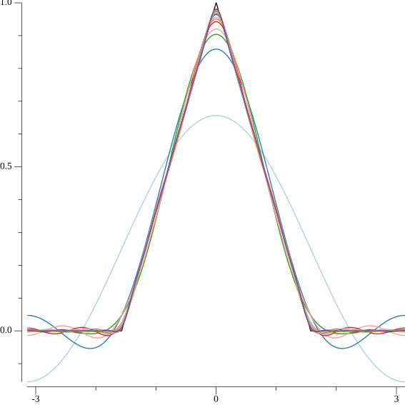
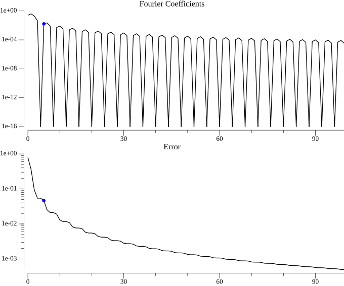

<!-- Code generated by `gd -o CH02_SEC01_1_FourierSines.md CH02_SEC01_1_FourierSines.go`; DO NOT EDIT. -->
```
//go:generate bash -c "rm -f CH02_SEC01_1_FourierSines*.png"
//go:generate gd -o CH02_SEC01_1_FourierSines.md CH02_SEC01_1_FourierSines.go

package main

import (
	"image/color"
	"log"
	"math"
	"sort"
	"strconv"

	"github.com/kortschak/gd/show"

	"gonum.org/v1/gonum/floats"
	"gonum.org/v1/gonum/stat"
	"gonum.org/v1/plot"
	"gonum.org/v1/plot/palette/brewer"
	"gonum.org/v1/plot/plotter"
	"gonum.org/v1/plot/vg"
	"gonum.org/v1/plot/vg/draw"
	"gonum.org/v1/plot/vg/vgimg"
)

func main() {
	// Define domain
	dx := 0.001
	l := math.Pi
	n := int(2 / dx)
	x := floats.Span(make([]float64, n), -1+dx, 1)
	floats.Scale(l, x)
	nQuart := n / 4

	// Define hat function
	f := make([]float64, len(x))
	floats.Span(f[nQuart:2*nQuart], 1, float64(nQuart))
	floats.Scale(4/float64(n), f[nQuart:2*nQuart])
	floats.Span(f[2*nQuart:3*nQuart], 0, float64(nQuart)-1)
	floats.Scale(-4/float64(n), f[2*nQuart:3*nQuart])
	floats.AddConst(1, f[2*nQuart:3*nQuart])

	p1 := plot.New()
	p1.Add(line(x, f, color.RGBA{A: 255}))

	// Compute Fourier series
	colors := brewer.Paired[10].Colors()
	a0 := floats.Sum(f) * dx
	fFS := make([]float64, len(x))
	floats.AddConst(a0/2, fFS)

	ct := make([]float64, len(x))
	st := make([]float64, len(x))
	for k := 0; k < 20; k++ {
		floats.ScaleTo(ct, math.Pi*float64(k+1)/l, x)
		for i, v := range ct {
			ct[i] = math.Cos(v)
		}
		floats.Scale(floats.Dot(ct, f)*dx, ct)

		floats.ScaleTo(st, math.Pi*float64(k+1)/l, x)
		for i, v := range st {
			st[i] = math.Sin(v)
		}
		floats.Scale(floats.Dot(st, f)*dx, st)

		floats.Add(fFS, ct)
		floats.Add(fFS, st)

		p1.Add(line(x, fFS, colors[k%len(colors)]))
	}

	c := vgimg.New(15*vg.Centimeter, 15*vg.Centimeter)
	p1.Draw(draw.New(c))
	show.PNG(c.Image(), "", "")
```
> 
```

	// Plot amplitudes
	fFS = make([]float64, len(f))
	floats.AddConst(a0/2, fFS)
	kMax := 100
	a := make([]float64, kMax)
	err := make([]float64, kMax)

	a[0] = a0 / 2
	err[0] = floats.Distance(f, fFS, 2) / floats.Norm(f, 2)

	for k := range err[1:] {
		k++

		floats.ScaleTo(ct, math.Pi*float64(k)/l, x)
		for i, v := range ct {
			ct[i] = math.Cos(v)
		}
		a[k] = floats.Dot(ct, f) * dx
		floats.Scale(a[k], ct)

		floats.ScaleTo(st, math.Pi*float64(k)/l, x)
		for i, v := range st {
			st[i] = math.Sin(v)
		}
		floats.Scale(floats.Dot(st, f)*dx, st)

		floats.Add(fFS, ct)
		floats.Add(fFS, st)

		err[k] = floats.Distance(f, fFS, 2) / floats.Norm(f, 2)
	}

	serr := make([]float64, len(err))
	copy(serr, err)
	sort.Float64s(serr)
	thresh := stat.Quantile(0.5, 1, serr, nil) * math.Sqrt(float64(kMax)) * (4 / math.Sqrt(3))
	var r int
	for i, v := range err {
		if v <= thresh {
			r = i - 1
			break
		}
	}

	p2 := [][]*plot.Plot{{plot.New()}, {plot.New()}}
	x = floats.Span(make([]float64, kMax), 0, 99)
	p2[0][0].Title.Text = "Fourier Coefficients"
	p2[0][0].Y.Tick.Marker = logTicks{powers: 4}
	p2[0][0].Add(
		line(x, a, color.RGBA{A: 255}),
		scatter([]float64{float64(r)}, []float64{a[r]}, color.RGBA{B: 255, A: 255}, draw.CircleGlyph{}),
	)
	p2[1][0].Title.Text = "Error"
	p2[1][0].Y.Tick.Marker = logTicks{}
	p2[1][0].Add(
		line(x, err, color.RGBA{A: 255}),
		scatter([]float64{float64(r)}, []float64{err[r]}, color.RGBA{B: 255, A: 255}, draw.CircleGlyph{}),
	)

	img := vgimg.New(18*vg.Centimeter, 15*vg.Centimeter)
	canvases := plot.Align(p2, draw.Tiles{Rows: 2, Cols: 1}, draw.New(img))
	for i, c := range canvases {
		p2[i][0].Y.Max = 1
		p2[i][0].Y.Scale = logScale{}
		p2[i][0].Draw(c[0])
	}

	show.PNG(img.Image(), "", "")
```
> 
```
}

```
The code below is helper code only.
```

func line(x, y []float64, col color.Color) *plotter.Line {
	l, err := plotter.NewLine(slicesToXYs(x, y))
	if err != nil {
		log.Fatal(err)
	}
	l.LineStyle.Color = col
	return l
}

func scatter(x, y []float64, col color.Color, glyph draw.GlyphDrawer) *plotter.Scatter {
	s, err := plotter.NewScatter(slicesToXYs(x, y))
	if err != nil {
		log.Fatal(err)
	}
	s.GlyphStyle.Color = col
	s.GlyphStyle.Shape = glyph
	return s
}

func slicesToXYs(x, y []float64) plotter.XYs {
	if len(x) != len(y) {
		log.Fatalf("mismatched data lengths %d != %d", len(x), len(y))
	}
	xy := make(plotter.XYs, len(x))
	for i := range x {
		xy[i] = plotter.XY{X: x[i], Y: y[i]}
	}
	return xy
}

type logScale struct{}

func (logScale) Normalize(min, max, x float64) float64 {
	min = math.Max(min, 1e-16)
	max = math.Max(max, 1e-16)
	x = math.Max(x, 1e-16)
	logMin := math.Log(min)
	return (math.Log(x) - logMin) / (math.Log(max) - logMin)
}

type logTicks struct{ powers int }

func (t logTicks) Ticks(min, max float64) []plot.Tick {
	min = math.Max(min, 1e-16)
	max = math.Max(max, 1e-16)
	if t.powers < 1 {
		t.powers = 1
	}

	val := math.Pow10(int(math.Log10(min)))
	max = math.Pow10(int(math.Ceil(math.Log10(max))))
	var ticks []plot.Tick
	for val < max {
		for i := 1; i < 10; i++ {
			if i == 1 {
				ticks = append(ticks, plot.Tick{Value: val, Label: strconv.FormatFloat(val, 'e', 0, 64)})
			}
			if t.powers != 1 {
				break
			}
			ticks = append(ticks, plot.Tick{Value: val * float64(i)})
		}
		val *= math.Pow10(t.powers)
	}
	ticks = append(ticks, plot.Tick{Value: val, Label: strconv.FormatFloat(val, 'e', 0, 64)})

	return ticks
}
```
