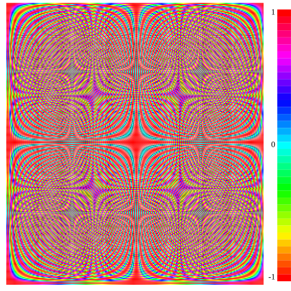

<!-- Code generated by `gd -o CH02_SEC02_1_DFT.md CH02_SEC02_1_DFT.go`; DO NOT EDIT. -->
```
//go:generate bash -c "rm -f CH02_SEC02_1_DFT*.png"
//go:generate gd -o CH02_SEC02_1_DFT.md CH02_SEC02_1_DFT.go

package main

import (
	"fmt"
	"math"
	"math/cmplx"

	"github.com/kortschak/gd/show"

	"gonum.org/v1/gonum/mat"
	"gonum.org/v1/plot"
	"gonum.org/v1/plot/palette"
	"gonum.org/v1/plot/plotter"
	"gonum.org/v1/plot/vg"
	"gonum.org/v1/plot/vg/draw"
	"gonum.org/v1/plot/vg/vgimg"
)

func main() {
	const n = 256
	w := cmplx.Exp(-1i * 2 * math.Pi / n)

	// Slow/Fast
	dft := mat.NewDense(256, 256, nil)
	for i := 0; i < n; i++ {
		for j := 0; j < n; j++ {
			iz := complex(float64(i), 0)
			jz := complex(float64(j), 0)
			dft.Set(i, j, real(cmplx.Pow(w, (iz-1)*(jz-1))))
		}
	}

```
The fast option in the Python code is not significantly different in
performance to the "slow" code above in Go and is not yet supported in
Gonum.
```

	p := plot.New()
	p.HideX()
	p.HideY()
	p.Add(plotter.NewHeatMap(grid{dft}, palette.Rainbow(256, 0, 1, 1, 1, 1)))

	l := plot.NewLegend()
	l.Top = true
	thumbs := plotter.PaletteThumbnailers(palette.Rainbow(39, 0, 1, 1, 1, 1))
	for i := len(thumbs) - 1; i >= 0; i-- {
		t := thumbs[i]
		if i != 0 && i != len(thumbs)/2 && i != len(thumbs)-1 {
			l.Add("", t)
			continue
		}
		var val float64
		switch i {
		case 0:
			val = -1
		case len(thumbs) - 1:
			val = 1
		}
		l.Add(fmt.Sprintf("%.2g", val), t)
	}

	c := vgimg.New(15*vg.Centimeter, 15*vg.Centimeter)
	dc := draw.New(c)

	r := l.Rectangle(dc)
	legendWidth := r.Max.X - r.Min.X
	l.YOffs = -p.Title.TextStyle.FontExtents().Height // Adjust the legend down a little.

	l.Draw(dc)
	dc = draw.Crop(dc, 0, -legendWidth-vg.Millimeter, 0, 0) // Make space for the legend.
	p.Draw(dc)

	show.PNG(c.Image(), "", "")
```
> 
```
}

```
The code below is helper code only.
```

type grid struct {
	Data mat.Matrix
}

func (g grid) Dims() (c, r int)   { r, c = g.Data.Dims(); return c, r }
func (g grid) Z(c, r int) float64 { return g.Data.At(r, c) }
func (g grid) X(c int) float64 {
	_, n := g.Data.Dims()
	if c < 0 || c >= n {
		panic("column index out of range")
	}
	return float64(c)
}
func (g grid) Y(r int) float64 {
	m, _ := g.Data.Dims()
	if r < 0 || r >= m {
		panic("row index out of range")
	}
	return float64(r)
}
```
