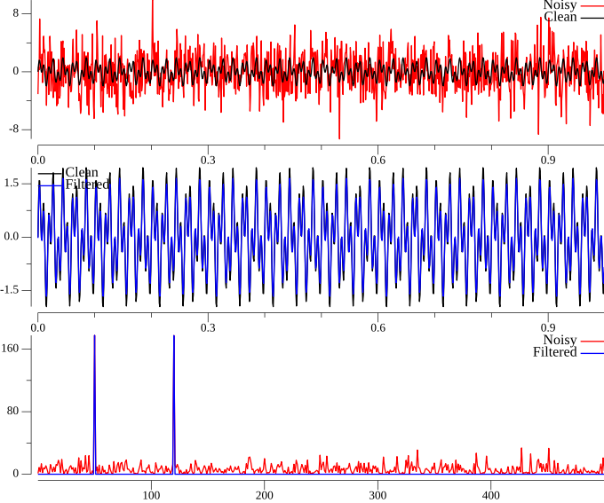

<!-- Code generated by `gd -o CH02_SEC02_2_Denoise.md CH02_SEC02_2_Denoise.go`; DO NOT EDIT. -->
```
//go:generate bash -c "rm -f CH02_SEC02_2_Denoise*.png"
//go:generate gd -o CH02_SEC02_2_Denoise.md CH02_SEC02_2_Denoise.go

package main

import (
	"image/color"
	"log"
	"math"
	"math/cmplx"
	"math/rand"

	"github.com/kortschak/gd/show"

	"gonum.org/v1/gonum/cmplxs"
	"gonum.org/v1/gonum/dsp/fourier"
	"gonum.org/v1/gonum/floats"
	"gonum.org/v1/plot"
	"gonum.org/v1/plot/plotter"
	"gonum.org/v1/plot/vg"
	"gonum.org/v1/plot/vg/draw"
	"gonum.org/v1/plot/vg/vgimg"
)

func main() {
	// Create a simple signal with two frequencies
	dt := 0.001
	t := floats.Span(make([]float64, int(1/dt)), 0, 1-dt)
	f := make([]float64, len(t))
	fClean := make([]float64, len(t))
	for i, v := range t {
		v = math.Sin(2*math.Pi*50*v) + math.Sin(2*math.Pi*120*v) // Sum of 2 frequencies
		fClean[i] = v
		f[i] = v + 2.5*rand.NormFloat64()
	}

	// Compute the Fast Fourier Transform (FFT)
	n := len(t)
	fft := fourier.NewFFT(n)
	fHat := fft.Coefficients(nil, f)
	psd := make([]float64, len(fHat))
	for i, v := range fHat {
		psd[i] = real(v*cmplx.Conj(v)) / float64(n)
	}
	freq := make([]float64, len(psd))
	for i := range freq {
		freq[i] = fft.Freq(i) * float64(n)
	}

	// Use the PSD to filter out noise
	psdClean := make([]float64, len(psd))
	for i, v := range psd {
		if v > 100 {
			psdClean[i] = v
		} else {
			fHat[i] = 0
		}
	}
	cmplxs.Scale(complex(1/float64(n), 0), fHat)
	fFilt := fft.Sequence(nil, fHat)

	// Plots
	p := [][]*plot.Plot{{plot.New()}, {plot.New()}, {plot.New()}}
	noisy := line(t, f, color.RGBA{R: 255, A: 255})
	original := line(t, fClean, color.RGBA{A: 255})
	p[0][0].Add(noisy, original)
	p[0][0].Legend.Top = true
	p[0][0].Legend.Add("Noisy", noisy)
	p[0][0].Legend.Add("Clean", original)

	filtered := line(t, fFilt, color.RGBA{B: 255, A: 255})
	p[1][0].Add(original, filtered)
	p[1][0].Legend.Top = true
	p[1][0].Legend.Left = true
	p[1][0].Legend.Add("Clean", original)
	p[1][0].Legend.Add("Filtered", filtered)

	psdLine := line(freq, psd, color.RGBA{R: 255, A: 255})
	filteredPsdLine := line(freq, psdClean, color.RGBA{B: 255, A: 255})
	p[2][0].Add(psdLine, filteredPsdLine)
	p[2][0].X.Tick.Marker = plot.ConstantTicks{{100, "100"}, {200, "200"}, {300, "300"}, {400, "400"}}
	p[2][0].Legend.Top = true
	p[2][0].Legend.Add("Noisy", psdLine)
	p[2][0].Legend.Add("Filtered", filteredPsdLine)

	img := vgimg.New(18*vg.Centimeter, 15*vg.Centimeter)
	canvases := plot.Align(p, draw.Tiles{Rows: 3, Cols: 1}, draw.New(img))
	for i, c := range canvases {
		p[i][0].Draw(c[0])
	}

	show.PNG(img.Image(), "", "")
```
> 
```
}

```
The code below is helper code only.
```

func line(x, y []float64, col color.Color) *plotter.Line {
	l, err := plotter.NewLine(slicesToXYs(x, y))
	if err != nil {
		log.Fatal(err)
	}
	l.LineStyle.Color = col
	return l
}

func slicesToXYs(x, y []float64) plotter.XYs {
	if len(x) != len(y) {
		log.Fatalf("mismatched data lengths %d != %d", len(x), len(y))
	}
	xy := make(plotter.XYs, len(x))
	for i := range x {
		xy[i] = plotter.XY{X: x[i], Y: y[i]}
	}
	return xy
}
```
