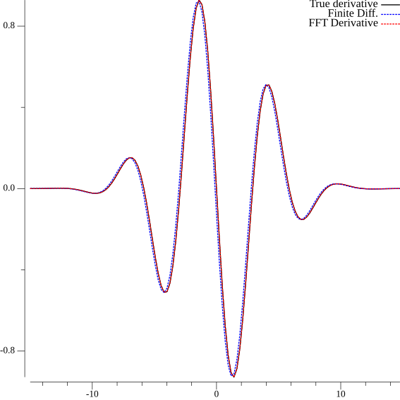

<!-- Code generated by `gd -o CH02_SEC02_3_SpectralDerivative.md CH02_SEC02_3_SpectralDerivative.go`; DO NOT EDIT. -->
```
//go:generate bash -c "rm -f CH02_SEC02_3_SpectralDerivative*.png"
//go:generate gd -o CH02_SEC02_3_SpectralDerivative.md CH02_SEC02_3_SpectralDerivative.go

package main

import (
	"image/color"
	"log"
	"math"
	"math/cmplx"

	"github.com/kortschak/gd/show"
	"gonum.org/v1/gonum/cmplxs"
	"gonum.org/v1/gonum/dsp/fourier"
	"gonum.org/v1/gonum/floats"
	"gonum.org/v1/plot"
	"gonum.org/v1/plot/plotter"
	"gonum.org/v1/plot/vg"
	"gonum.org/v1/plot/vg/draw"
	"gonum.org/v1/plot/vg/vgimg"
)

func main() {
	n := 128
	l := 30
	dx := float64(l) / float64(n)
	x := cmplxs.Span(make([]complex128, n), complex(float64(-l/2), 0), complex(float64(l/2)-dx, 0))
	f := make([]complex128, len(x))
	df := make([]complex128, len(x))
	for i, z := range x {
		fn := cmplx.Cos(z) * cmplx.Exp(-cmplx.Pow(z, 2)/25)
		f[i] = fn                                                                // Function
		df[i] = -(cmplx.Sin(z)*cmplx.Exp(-cmplx.Pow(z, 2)/25) + (2.0/25.0)*z*fn) // Derivative
	}

	// Approximate derivative using finite difference
	dfFd := make([]complex128, len(df))
	for k, z := range f[1:] {
		dfFd[k] = (z - f[k]) / complex(dx, 0)
	}
	dfFd[len(dfFd)-1] = dfFd[len(dfFd)-2]

	// Derivative using FFT (spectral derivative)
	fft := fourier.NewCmplxFFT(len(f))
	fHat := fft.Coefficients(nil, f)
	kappa := floats.Span(make([]float64, n), -float64(n/2), float64(n/2)-1)
	floats.Scale(2*math.Pi/float64(l), kappa)
	kappaShft := make([]complex128, len(kappa))
	for i, v := range kappa {
		kappaShft[fft.ShiftIdx(i)] = complex(v, 0)
	}
	dfHat := cmplxs.MulTo(make([]complex128, len(fHat)), kappaShft, fHat)
	cmplxs.Scale(1i, dfHat)

	cmplxs.Scale(complex(1/float64(n), 0), dfHat)
	dfFft := fft.Sequence(nil, dfHat)

	// Plots
	p := plot.New()
	truth := line(realOf(x), realOf(df), color.RGBA{A: 255}, nil)
	finiteDiff := line(realOf(x), realOf(dfFd), color.RGBA{B: 255, A: 255}, []vg.Length{2, 1})
	fftDeriv := line(realOf(x), realOf(dfFft), color.RGBA{R: 255, A: 255}, []vg.Length{2, 1})

	p.Add(truth, finiteDiff, fftDeriv)
	p.Legend.Top = true
	p.Legend.Add("True derivative", truth)
	p.Legend.Add("Finite Diff.", finiteDiff)
	p.Legend.Add("FFT Derivative", fftDeriv)

	c := vgimg.New(15*vg.Centimeter, 15*vg.Centimeter)
	p.Draw(draw.New(c))
	show.PNG(c.Image(), "", "")
```
> 
```
}

```
The code below is helper code only.
```

func line(x, y []float64, col color.Color, dashes []vg.Length) *plotter.Line {
	l, err := plotter.NewLine(slicesToXYs(x, y))
	if err != nil {
		log.Fatal(err)
	}
	l.LineStyle.Color = col
	l.LineStyle.Dashes = dashes
	return l
}

func slicesToXYs(x, y []float64) plotter.XYs {
	if len(x) != len(y) {
		log.Fatalf("mismatched data lengths %d != %d", len(x), len(y))
	}
	xy := make(plotter.XYs, len(x))
	for i := range x {
		xy[i] = plotter.XY{X: x[i], Y: y[i]}
	}
	return xy
}

func realOf(z []complex128) []float64 {
	r := make([]float64, len(z))
	cmplxs.Real(r, z)
	return r
}
```
